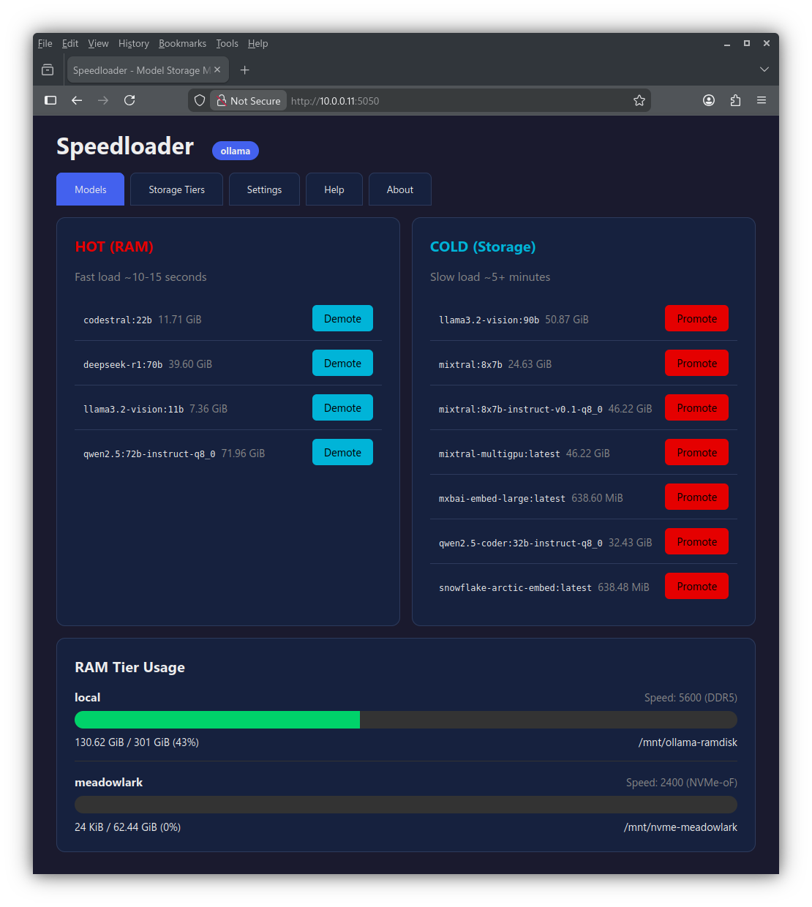
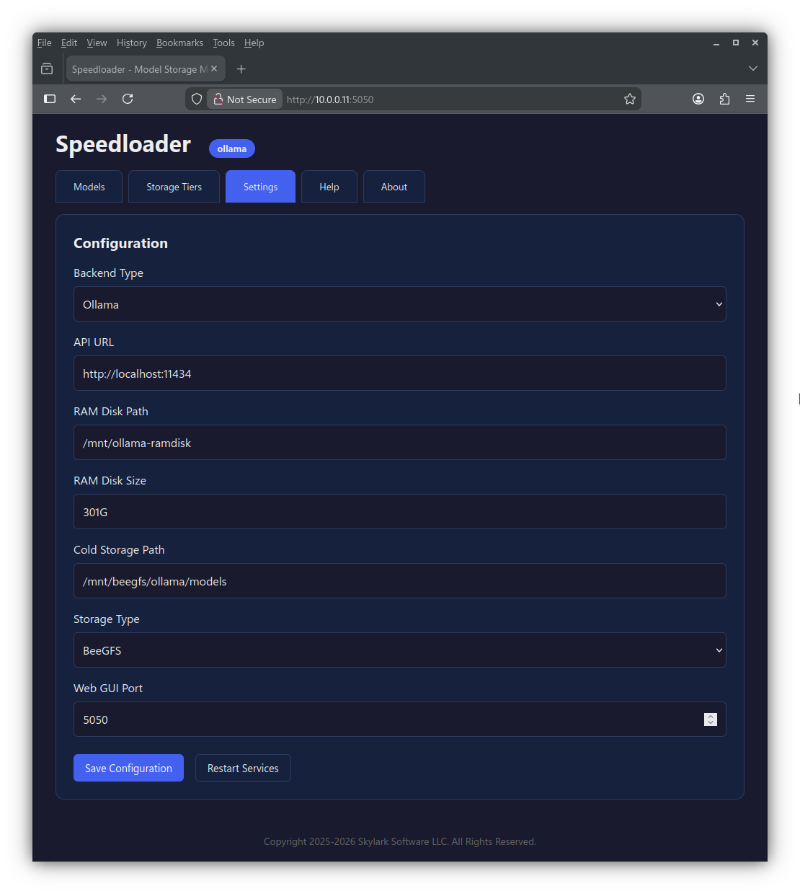

<p align="center">
  
</p>

# Speedloader

Fast hybrid RAM/storage management for LLM models.

## Overview

Speedloader creates a hybrid storage tier that keeps frequently-used LLM models in RAM for instant access (~10-15 seconds) while storing others on cold storage.

**Features:**
- Single binary (~5MB) with no dependencies
- Web GUI for easy model management
- Multi-tier RAM storage with speed-based placement
- Remote RAM pooling via NVMe-oF over RDMA
- Support for Ollama, llama.cpp, vLLM, and HuggingFace backends

## Quick Start

```bash
# Clone the repo
git clone https://github.com/Skylark-Software/Speedloader.git
cd Speedloader

# Install binary
sudo cp bin/speedloader /usr/local/bin/
sudo chmod +x /usr/local/bin/speedloader

# Run interactive installer (detects system, creates config, installs services)
sudo speedloader install

# Web GUI at http://localhost:5050
```

## Usage

```bash
# Show model status
speedloader status

# Promote a model to RAM
sudo speedloader promote mixtral:8x7b

# Demote a model from RAM
sudo speedloader demote llama3:70b

# Start web GUI
speedloader serve --port 5050

# Show configuration
speedloader config

# Run health check
speedloader health
```

## Web GUI

Access the web dashboard at **http://localhost:5050** after installation.

### Models Tab
View hot/cold model status with RAM tier usage. Promote models to RAM or demote them to storage with one click.



### Storage Tiers Tab
Manage multiple RAM storage tiers — local DDR5, remote NVMe-oF over RDMA, and more. Configure model placement strategies and pin specific models to tiers.

**Features:**
- **Multiple RAM Tiers**: Local tmpfs + remote NVMe-oF RAM pools
- **Speed Ratings**: DDR5-5600, DDR4-3200, NVMe-oF, etc.
- **Placement Strategies**: Fastest-fit (auto-failover), fill-first, round-robin
- **Pinned Models**: Hard-assign models to specific tiers

### Settings Tab
Configure backend, storage paths, and RAM disk settings.



## Commands

| Command | Description |
|---------|-------------|
| `status` | Show hot/cold model status |
| `promote <model>` | Move model to RAM |
| `demote <model>` | Move model to storage |
| `serve` | Start web GUI server |
| `install` | Interactive installation |
| `init` | Initialize RAM disk |
| `config` | Show configuration |
| `health` | Health check and auto-repair |

## Supported Backends

| Backend | Storage Format | Default API Port |
|---------|---------------|------------------|
| `ollama` | Blobs + Manifests | 11434 |
| `llamacpp` | Single GGUF files | 8080 |
| `vllm` | HuggingFace directories | 8000 |
| `huggingface` | Safetensors directories | N/A |

## Configuration

Configuration is stored at `/etc/speedloader/config.json`.

The interactive installer (`sudo speedloader install`) detects your system and generates the config. You can also edit it manually:

```json
{
  "ramdisk": {
    "path": "/mnt/ollama-ramdisk",
    "size": "32G"
  },
  "storage": {
    "path": "/home/user/.ollama/models",
    "type": "local"
  },
  "backend": {
    "type": "ollama",
    "apiUrl": "http://localhost:11434"
  },
  "web": {
    "port": 5050,
    "host": "0.0.0.0"
  }
}
```

## System Requirements

- Linux (x86_64 or ARM64)
- Systemd (for service management)
- Root access (for RAM disk mounting)

## License

Copyright 2025-2026 Skylark Software LLC. All Rights Reserved.

This is proprietary software. Unauthorized copying, modification, or distribution is prohibited.

---

<p align="center">
  
</p>
